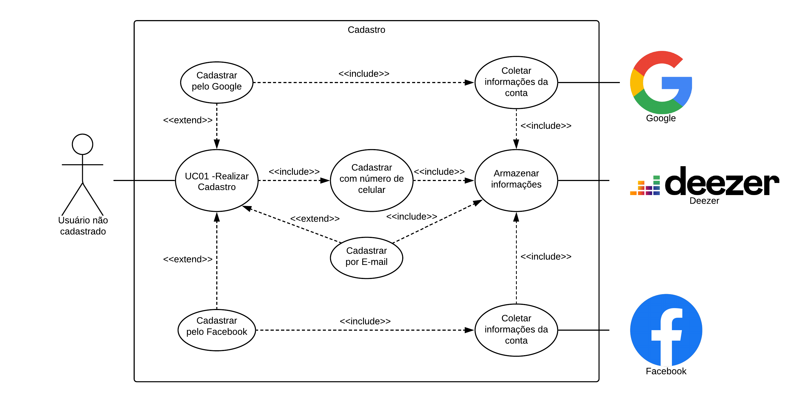
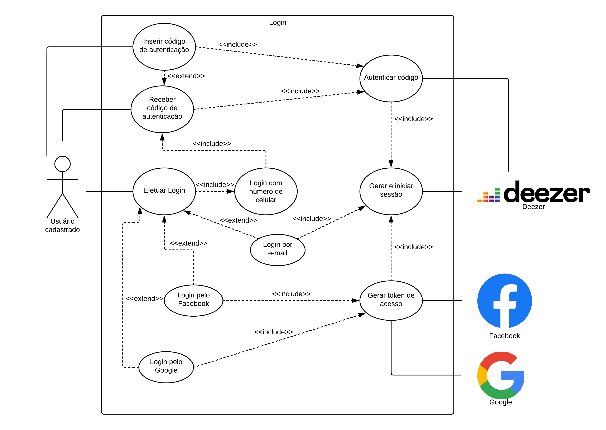
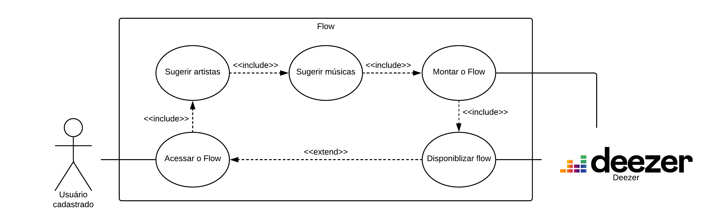
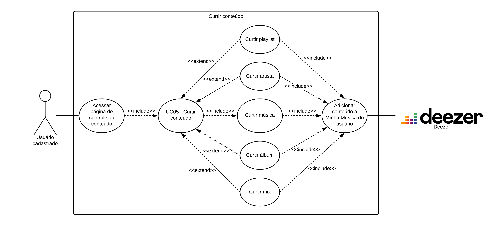

# Diagramas de Caso de Uso

## Versões

<table class="versions">
	<tr>
		<th class="version_header">Versão</th>
		<th>Detalhes</th>
		<th>Data</th>
	</tr>
	<tr>
		<td>1.0</td>
		<td>Versão Inicial.</td>
		<td>27/09/2019</td>
	</tr>
	<tr>
		<td>1.1</td>
		<td>Adição de pesquisa de conteúdo e correção nos atores.</td>
		<td>29/09/2019</td>
	</tr>
	<tr>
		<td>1.2</td>
		<td>Adição de curtir conteúdo.</td>
		<td>29/09/2019</td>
	</tr>
	<tr>
		<td>1.3</td>
		<td>Adição de participantes e datas.</td>
		<td>29/09/2019</td>
	</tr>
</table> 
 

## Participantes
- Samuel Pereira

## Cadastro de Usuário

## [Login](/modelagem/lexico#login) de Usuário

## [Flow](/modelagem/lexico#flow)

## Pesquisa de conteúdo

## Curtir conteúdo

