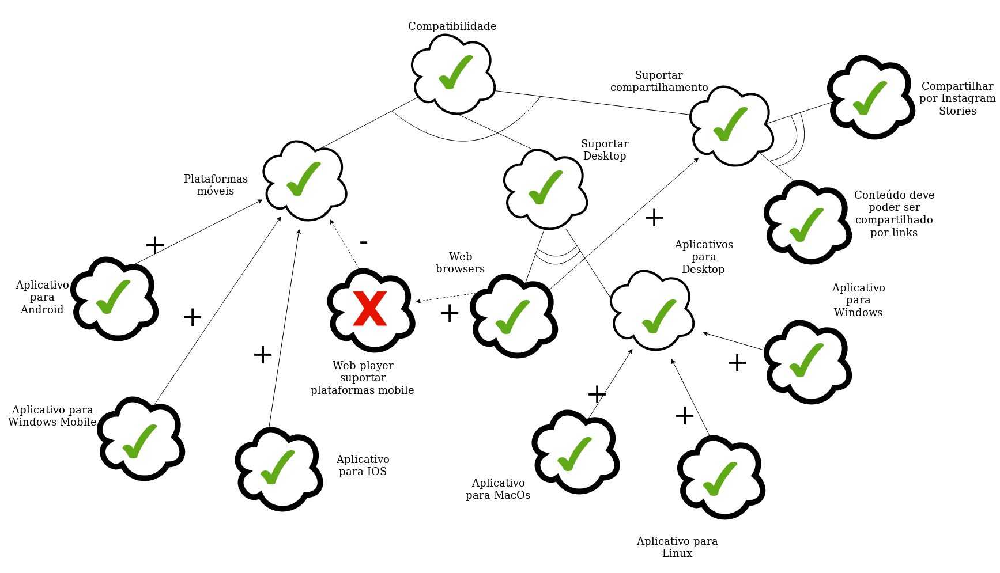

# NFR

## Versões

<table class="versions">
	<tr>
		<th class="version_header">Versão</th>
		<th>Detalhes</th>
		<th>Data</th>
	</tr>
	<tr>
		<td>1.0</td>
		<td>Adição do NFR de Compatibilidade.</td>
		<td>16/10/2019</td>
  </tr>
  <tr>
		<td>1.1</td>
		<td>Adição do NFR de Usabilidade.</td>
		<td>16/10/2019</td>
	</tr>
	<tr>
		<td>1.2</td>
		<td>Adição do NFR de Confiabilidade.</td>
		<td>16/10/2019</td>
	</tr>
	<tr>
		<td>1.3</td>
		<td>Conserto de NFR de Compatibilidade.</td>
		<td>17/10/2019</td>
	</tr>
</table> 
 

### Participantes:
- Luis Taira
- Eduardo Lima
- Sofia Patrocínio

### Compatibilidade

### Usabilidade

### Confiabilidade

