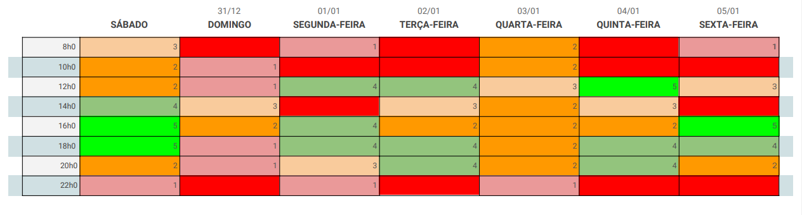

# Planejamento

## Heatmap

&emsp;
Para o planejamento do projeto, estamos utilizando o Google Calendar, onde agendamos todas as datas dos Pontos de Controle. Para melhor visualização, disponibilizaremos aqui o planejamento de cada semana.
 

## Pré-rastreabilidade - 03/09
Realizado de 27/08 até 02/09.

|Tarefa|Participante(s)|Entrega | Entrega  Prevista
|--|---------|------|---|
|Rich Picture|Todos os membros.| 30/08| 01/08
|Wiki|Samuel Pereira.|02/09| 01/08
|Planejamento|Luís Henrique.|02/09| 01/08

 

## Elicitação e Priorização - 12/09 
Realizado de 03/09 até 12/09.
 
Adicionamos novas técnicas e melhorias após o Ponto de Controle realizadas até 25/09.
|Tarefa|Participante(s)|Entrega | Entrega  Prevista
|--|---------|------|---|
|Entrevista|Todos os membros| 25/09| 25/09
|Análise de Protocolo|Todos os membros|23/09| 25/09
|Introspecção|Todos os membros|11/09| 11/09
|Observação Participativa|Todos os membros|05/09| 11/09
|Questionário|Todos os membros| Ainda no ar | Fim da disciplina
|Moscow|Todos os membros|10/09| 11/09
 

## Modelagem - 1/10 
26/09 - 30/09

|Tarefa|Participante(s)|Entrega | Entrega  Prevista
|--|---------|------|---|
|Léxicos|Luís Henrique|29/09 | 29/09
|Cenários|Eduardo|30/09| 29/09
|Diagramas|Samuel|29/09| 29/09
|Casos de Uso|Micaella|29/09| 29/09
|Especificação Suplementar|Sofia|29/09| 29/09

## Modelagem - 17/10 
30/09 - 15/10

|Tarefa|Participante(s)|Entrega | Entrega  Prevista
|--|---------|------|---|
|Backlogs|- |-|15/10
|Histórias de Usuário|Micaella|-|15/10
|NFR|-|-|15/10
